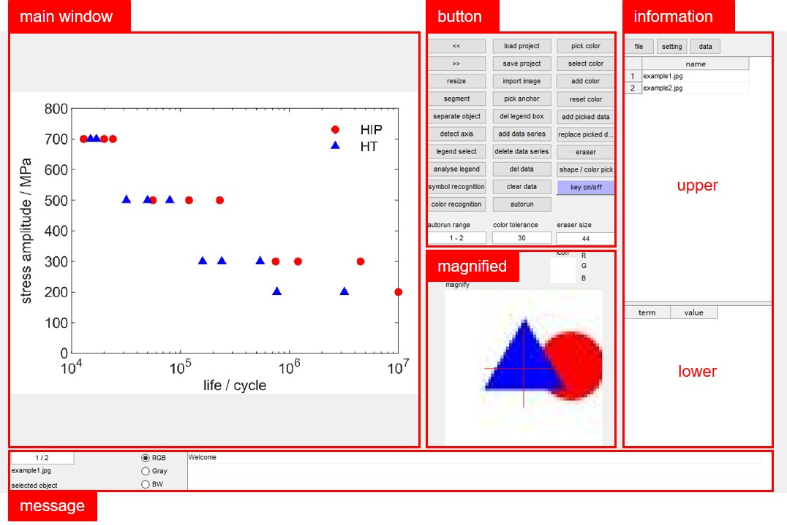

# IMageEXtractor

The IMageExtractor (IMEX) is a MATLAB app for data extraction from scatter plots, enabling automatic extraction, and manual extraction and correction.
The app is originally developed for fatigue data extraction, but can be generalized for other data presented as scatter plots.

The app is developed with MATLAB R2018b, with add-on `Computer Vison Toolbox v8.2` installed. 

The app is launched by running `imex.m` in MATLAB. See `imex_manual.pdf` for a quickstart.

