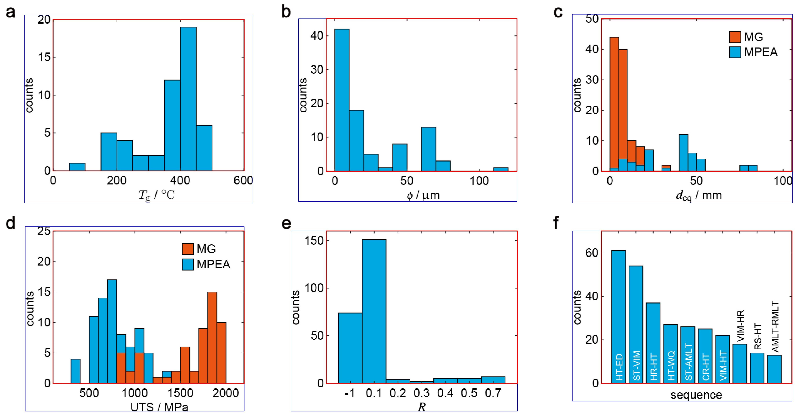

# Figure segmentation

Figure segmentation is conducted by a MATLAB script (`figure_segment.m`) with rule-based algorithms.

The input of the script includes<br>
&ensp;&ensp;&ensp;&ensp;*figpath*: the path of the figure.<br>
&ensp;&ensp;&ensp;&ensp;*figname*: the name of the figure.<br>
&ensp;&ensp;&ensp;&ensp;*outpath*: the path for storing segmented figures.<br>
&ensp;&ensp;&ensp;&ensp;*thre_bw*: the threshold to transform grayscale figures to black-and-white figures.<br>
&ensp;&ensp;&ensp;&ensp;*thre_panel*: the threshold of relative size to regard the figure object as a figure panel.<br>
&ensp;&ensp;&ensp;&ensp;*thre_axis*: the threshold of length to detect the axis.<br>

The output is segmented figures, both the core and the extended parts. The core part of the figure is the largest separated figure object in the panel (Fig. 1, red box). The core part is used for figure classification. The extended part includes potential figure titles, axis labels, and axis tick labels(Fig. 1, blue box). The extended part is used for subsequent figure data extraction.

The main function to process the figure is defined as

``` matlab
function [extend_box,core_box]=process_figure(rgb,thre_bw,thre_panel,thre_axis)
``````

where *rgb* is the matrix of the figures. *core_box*, *extend_box* are *n* $\times$ 4 arrays, and each row is the leftmost, rightmost, uppermost, and lowermost pixels of the core part and extended part of a segmented figure, respectively.
The rule-based algorithm inherits from [IMEX](https://github.com/xuzpgroup/ZianZhang/tree/main/FatigueData-AM2022/IMEX). The large figure objects are determined based on *thre_panel*. And then, the axis, axis label, tick labels, and titles are searched among the surrounding figure objects.


Fig. 1 The example result of figure segmentation. The red boxes contain the core part of each panel and the blue boxes contain the extended part of each panel.


# Figure classification

Figure classification is conducted by `pred.py` with a ResNet50 model (`best.pth`). The input of the script is the path and names of figures, stored in the variable *figpath* and *figures*, respectively. The results are output to a JSON file, `pred.json`. The names of figures are stored in the file, with flags denoting whether figures are fatigue (1) or not (0). Example figures are in the `example` folder. It is noted that the figures used for classification are the core parts as defined above.
